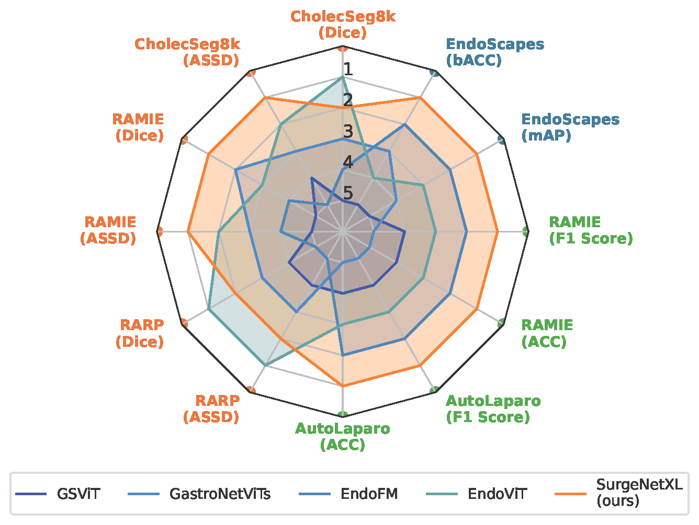
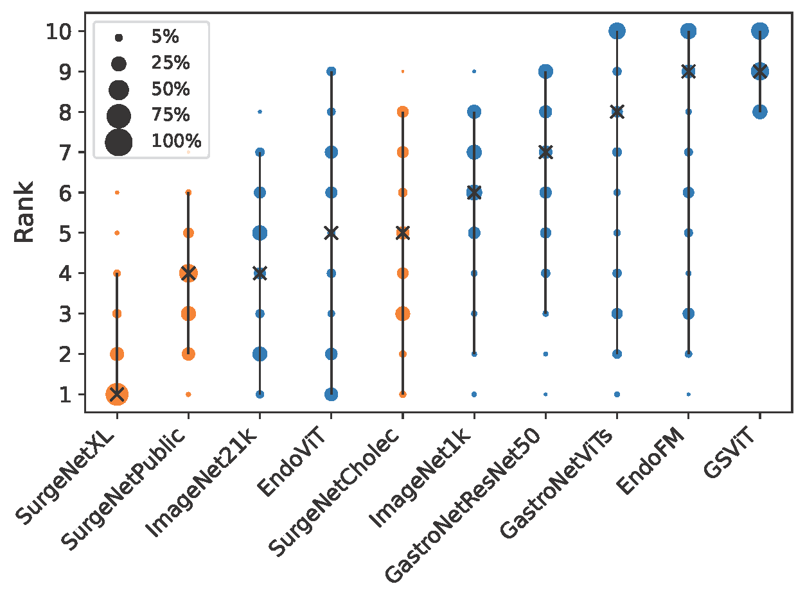
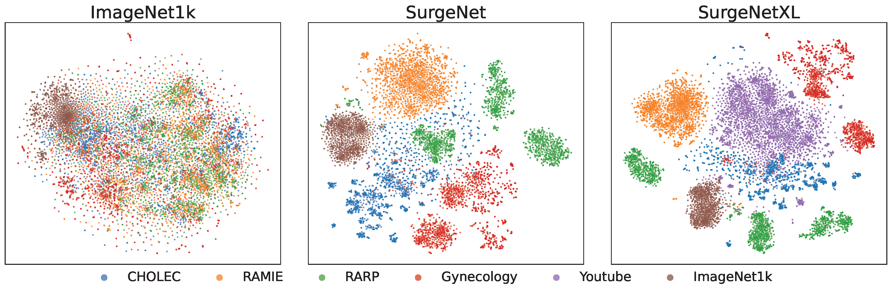

<div align="center">
<h1>Publications</h1> 

<h3>Scaling up self-supervised learning for improved surgical foundation models</h3>

[Tim J.M. Jaspers](https://timjaspers0801.github.io/)<sup>1* :email:</sup>, [Ronald L.P.D. de Jong](https://scholar.google.com/citations?user=We226GgAAAAJ&hl=en)<sup>2*</sup>,
[Yiping Li](https://research.tue.nl/nl/persons/yiping-li/publications/)<sup>2</sup>, [Carolus H.J. Kusters](https://chjkusters.github.io/)<sup>1</sup>, Franciscus H.A. Bakker<sup>5</sup>,
Romy C. van Jaarsveld<sup>3</sup>, Gino M. Kuipers<sup>3</sup>, Richard<sup>3</sup>, Jelle P. Ruurda<sup>3</sup>, 
Willem M. Brinkman<sup>4</sup>, Josien P.W. Pluim<sup>2</sup>,
Peter H.N. de With<sup>1</sup>, Marcel Breeuwer<sup>2</sup>, [Yasmina Al Khalil](https://scholar.google.com/citations?user=m6co7N0AAAAJ&hl=en)<sup>2</sup>, [Fons van der Sommen](https://scholar.google.com/citations?user=qFiLkCAAAAAJ&hl=en)<sup>1</sup>

<sup>1</sup>  Department of Electrical Engineering, Video Coding & Architectures, Eindhoven University of Technology \
<sup>2</sup>  Department of Biomedical Engineering, Medical Image Analysis, Eindhoven University of Technology, Eindhoven, The Netherlands \
<sup>3</sup>  Department of Surgery, University Medical Center Utrecht, Utrecht, The Netherlands \
<sup>4</sup>  Department of Oncological Urology, University Medical Center Utrecht, Utrecht, The Netherlands \
<sup>5</sup>  Department of Surgery, Catharina Hospital, Eindhoven, The Netherlands

<sup>*</sup> Both authors attributed equally \
(<sup>:email:</sup>) corresponding author

*arxiv* <br /> ([Article](https://doi.org/10.1016/j.media.2024.103348))

<h3> Exploring the Effect of Dataset Diversity in Self-Supervised Learning for Surgical Computer Vision</h3>

[Tim J.M. Jaspers](https://timjaspers0801.github.io/)<sup>1:email:</sup>, [Ronald L.P.D. de Jong](https://scholar.google.com/citations?user=We226GgAAAAJ&hl=en)<sup>2</sup>,
 [Yasmina Al Khalil](https://scholar.google.com/citations?user=m6co7N0AAAAJ&hl=en)<sup>2</sup>, Tijn Zeelenberg <sup>1</sup>, [Carolus H.J. Kusters](https://chjkusters.github.io/)<sup>1</sup>, Franciscus H.A. Bakker<sup>5</sup>,
[Yiping Li](https://research.tue.nl/nl/persons/yiping-li/publications/)<sup>2</sup>, Romy C. van Jaarsveld<sup>3</sup>, Jelle P. Ruurda<sup>3</sup>, Willem M. Brinkman<sup>4</sup>,
Peter H.N. de With<sup>1</sup>, [Fons van der Sommen](https://scholar.google.com/citations?user=qFiLkCAAAAAJ&hl=en)<sup>1</sup>,

*Second Workshop on Data Engineering in Medical Imaging &#40;DEMI&#41; - Satellite Event MICCAI 2024* <br /> ([Proceeding](https://link.springer.com/chapter/10.1007/978-3-031-73748-0_5))


<sup>1</sup>  Department of Electrical Engineering, Video Coding & Architectures, Eindhoven University of Technology \
<sup>2</sup>  Department of Biomedical Engineering, Medical Image Analysis, Eindhoven University of Technology, Eindhoven, The Netherlands \
<sup>3</sup>  Department of Surgery, University Medical Center Utrecht, Utrecht, The Netherlands \
<sup>4</sup>  Department of Oncological Urology, University Medical Center Utrecht, Utrecht, The Netherlands \
<sup>5</sup>  Department of Surgery, Catharina Hospital, Eindhoven, The Netherlands

(<sup>:email:</sup>) corresponding author


## Abstract
Foundation models have revolutionized computer vision by achieving state-of-the-art
performance across diverse tasks through large-scale pretraining on extensive datasets.
However, their application in surgical computer vision has been limited. This study
addresses this gap by introducing SurgeNetXL, a novel surgical foundation model
that sets a new benchmark in surgical computer vision. Trained on the largest reported surgical dataset to date,
comprising over 4.7 million video frames, SurgeNetXL
achieves consistent top-tier performance across six datasets spanning four surgical
procedures and three tasks, including semantic segmentation, phase recognition, and
critical view of safety (CVS) classification. Compared to the best-performing surgical
foundation models, SurgeNetXL shows mean improvements of 0.26%, 8.95%,
and 12.6% for semantic segmentation, phase recognition, and CVS classification, respectively. 
Additionally, SurgeNetXL outperforms the best-performing ImageNet-based variants
by 10.3%, 4.0%, and 1.6% in the respective tasks. In addition to
advancing model performance, this work provides key insights into scaling pretraining datasets,
extending training durations, and optimizing model architectures specifically for surgical computer vision.
These findings pave the way for improved generalizability and robustness in data-scarce scenarios,
offering a comprehensive framework for future research in this domain.


## Results
The following figures are from our publications, showcasing the performance of our introduced foundation model
across diverse surgical tasks and procedures. These results demonstrate the model’s state-of-the-art
performance on a variety of downstream tasks, reflecting its versatility and robustness in handling
datasets from multiple surgical procedures.

Figure 1 and Figure 2 illustrate comparative rankings of our model against existing benchmarks,
highlighting its superior generalization capabilities across datasets. Figure 3 provides a t-SNE visualization,
showcasing the clear cluster separation per specific dataset achieved by the model’s feature embeddings, 
further emphasizing its effectiveness in capturing meaningful representations.

<div style="display: flex; justify-content: space-around; align-items: center; gap: 20px;">

<div style="text-align: center;">
    
    <p><strong>Fig 1:</strong> Radar chart showing model ranks across datasets.</p>
</div>

<div style="text-align: center;">
    
    <p><strong>Fig 2:</strong> Blob chart representing ranking metrics for models.</p>
</div>

</div>

<div style="text-align: center; margin-top: 20px;">
    
    <p><strong>Fig 3:</strong> t-SNE visualization of feature embeddings showing cluster separation across datasets.</p>
</div>


## Models
The models used in this study are based on the [MetaFormer](https://arxiv.org/abs/2210.13452) architecture. The models are trained using a self-supervised learning
approach on the SurgeNetXL dataset and its variations, 
introduced this in the following [paper](https://). All model weights can be downloaded from the table below.

| Model           | Backbone   | Epochs | Teacher Backbone                                                                                                                                | Full DINO checkpoint                                                                                                              |
|-----------------|------------|--------|-------------------------------------------------------------------------------------------------------------------------------------------------|-----------------------------------------------------------------------------------------------------------------------------------|
| SurgeNetXL      | CaFormer   | 50     | [Download](https://huggingface.co/TimJaspersTue/SurgeNetModels/resolve/main/SurgeNetXL_checkpoint_epoch0050_teacher.pth?download=true)          | [Download](https://huggingface.co/TimJaspersTue/SurgeNetModels/resolve/main/SurgeNetXL_checkpoint0050.pth?download=true)          |
| SurgeNetSmall  | CaFormer   | 50     | [Download](https://huggingface.co/TimJaspersTue/SurgeNetModels/resolve/main/SurgeNetSmall_checkpoint_epoch0050_teacher.pth?download=true)       | [Download](https://huggingface.co/TimJaspersTue/SurgeNetModels/resolve/main/SurgeNetSmall_checkpoint0050.pth?download=true)       |
| SurgeNetCholec | CaFormer   | 50     | [Download](https://huggingface.co/TimJaspersTue/SurgeNetModels/resolve/main/CHOLEC_checkpoint_epoch0050_teacher.pth?download=true)              | [Download](https://huggingface.co/TimJaspersTue/SurgeNetModels/resolve/main/CHOLEC_checkpoint0050.pth?download=true)              | 
| SurgeNetRAMIE  | CaFormer   | 50     | [Download](https://huggingface.co/TimJaspersTue/SurgeNetModels/resolve/main/RAMIE_checkpoint_epoch0050_teacher.pth?download=true)               | [Download](https://huggingface.co/TimJaspersTue/SurgeNetModels/resolve/main/RAMIE_checkpoint0050.pth?download=true)               | 
| SurgeNetRARP   | CaFormer   | 50     | [Download](https://huggingface.co/TimJaspersTue/SurgeNetModels/resolve/main/RARP_checkpoint_epoch0050_teacher.pth?download=true)                | [Download](https://huggingface.co/TimJaspersTue/SurgeNetModels/resolve/main/RARP_checkpoint0050.pth?download=true)                |
| SurgeNet-Public | CaFormer   | 50     | [Download](https://huggingface.co/TimJaspersTue/SurgeNetModels/resolve/main/Public_checkpoint_epoch0050_teacher.pth?download=true)              | [Download](https://huggingface.co/TimJaspersTue/SurgeNetModels/resolve/main/Public_checkpoint0050.pth?download=true)              |
| SurgeNet        | CaFormer   | 50     | [Download](https://huggingface.co/TimJaspersTue/SurgeNetModels/resolve/main/SurgeNet_checkpoint_epoch0050_teacher.pth?download=true)            | [Download](https://huggingface.co/TimJaspersTue/SurgeNetModels/resolve/main/SurgeNet_checkpoint0050.pth?download=true)            |
| SurgeNet        | ConvNextv2 | 50     | [Download](https://huggingface.co/TimJaspersTue/SurgeNetModels/resolve/main/SurgeNet_ConvNextv2_checkpoint_epoch0050_teacher.pth?download=true) | [Download](https://huggingface.co/TimJaspersTue/SurgeNetModels/resolve/main/SurgeNet_ConvNextv2_checkpoint0050.pth?download=true) |
| SurgeNet        | PVTv2      | 50     | [Download](https://huggingface.co/TimJaspersTue/SurgeNetModels/resolve/main/SurgeNet_PVTv2_checkpoint_epoch0050_teacher.pth?download=true)      | [Download](https://huggingface.co/TimJaspersTue/SurgeNetModels/resolve/main/SurgeNet_PVTv2_checkpoint0050.pth?download=true)      |

## Loading Models
The weights from the teacher network can be used to initialize either your classification or segmentation model using the following code snippet: 
</div>


```python
import torch
from metaformer import caformer_s18, MetaFormerFPN
from convnextv2 import convnextv2_tiny, ConvNextFPN
from pvtv2 import pvt_v2_b2, PVTV2FPN

urls = {
    "ImageNet1k": "https://huggingface.co/sail/dl/resolve/main/caformer/caformer_s18.pth",
    "SurgeNetXL": "https://huggingface.co/TimJaspersTue/SurgeNetModels/resolve/main/SurgeNetXL_checkpoint_epoch0050_teacher.pth?download=true",
    "SurgeNet": "https://huggingface.co/TimJaspersTue/SurgeNetModels/resolve/main/SurgeNet_checkpoint_epoch0050_teacher.pth?download=true",
    "SurgeNet-Small": "https://huggingface.co/TimJaspersTue/SurgeNetModels/resolve/main/SurgeNetSmall_checkpoint_epoch0050_teacher.pth?download=true",
    "SurgeNet-CHOLEC": "https://huggingface.co/TimJaspersTue/SurgeNetModels/resolve/main/CHOLEC_checkpoint_epoch0050_teacher.pth?download=true",
    "SurgeNet-RAMIE": "https://huggingface.co/TimJaspersTue/SurgeNetModels/resolve/main/RAMIE_checkpoint_epoch0050_teacher.pth?download=true",
    "SurgeNet-RARP": "https://huggingface.co/TimJaspersTue/SurgeNetModels/resolve/main/RARP_checkpoint_epoch0050_teacher.pth?download=true",
    "SurgeNet-Public": "https://huggingface.co/TimJaspersTue/SurgeNetModels/resolve/main/Public_checkpoint0050.pth?download=true",
    "SurgeNet-ConvNextv2": "https://huggingface.co/TimJaspersTue/SurgeNetModels/resolve/main/SurgeNet_ConvNextv2_checkpoint_epoch0050_teacher.pth?download=true",
    "SurgeNet-PVTv2": "https://huggingface.co/TimJaspersTue/SurgeNetModels/resolve/main/SurgeNet_PVTv2_checkpoint_epoch0050_teacher.pth?download=true",
}

# Metaformer model
classification_model = caformer_s18(num_classes=12, pretrained='SurgeNet', pretrained_weights=urls['SurgeNetXL'])
segmentation_model = MetaFormerFPN(num_classes=12, pretrained='SurgeNet', pretrained_weights=urls['SurgeNetXL'])

# ConvNextv2 model
classification_model = convnextv2_tiny(num_classes=12, pretrained_weights=urls['SurgeNet-ConvNextv2'])
segmentation_model = ConvNextFPN(num_classes=12, pretrained_weights=urls['SurgeNet-ConvNextv2'])

# PVTv2 model
classification_model = pvt_v2_b2(num_classes=12, pretrained_weights=urls['SurgeNet-PVTv2'])
segmentation_model = PVTV2FPN(num_classes=12, pretrained_weights=urls['SurgeNet-PVTv2'])

```

<div align="center">
Note: If your want a different version of SurgeNet weights (e.g. SurgeNet-Small), you can replace the `pretrained_weights` argument with the desired url (leave the `pretrained` argument as it is).

## Surgical Youtube Dataset
A key contribution of our research is the Surgical YouTube dataset, which enhanced our foundation model's
performance. This curated dataset contains 2,074,234 frames sampled from 23 distinct surgical procedures
and is publicly available at [huggingface datasets.](https://huggingface.co/datasets/TimJaspersTue/SurgeNetYoutube)
This datasets is a large part of our SurgeNetXL dataset, which also includes other opensource datasets.

| Procedure-specific subset | Dataset                                                        | Procedure | #videos | #frames   | Public |
|---------------------------|----------------------------------------------------------------|-----------|---------|-----------|--------|
| **SurgeNetCholec**        | Cholec80 ([Twinnanda et al., 2017b](https://arxiv.org/abs/1602.03012))    | Laparoscopic Cholecystectomy | 76 | 179,164   | Yes    |
|                           | HeiChole ([Maier-Hein et al., 2021](https://www.synapse.org/Synapse:syn25101790/wiki/608802))    | Laparoscopic Cholecystectomy | 30 | 53,427    | Yes    |
|                           | hSDB-Chole ([Yoon et al., 2021](https://arxiv.org/abs/2110.12555))         | Laparoscopic Cholecystectomy | 24 | 18,064    | Yes    |
| **SurgeNetRAMIE**         | RAMIE-UMCU                                                     | RA Esophagectomy | 28 | 377,287   | No     |
| **SurgeNetRARP**          | ESAD [Bawa et al., 2021](https://arxiv.org/abs/2006.07164)                | RA Esophagectomy | 28 | 47,282    | Yes    |
|                           | PSI-AVA [Valderrama et al., 2022](https://arxiv.org/abs/2212.04582)       | RA Prostatectomy | 8 | 73,618    | Yes    |
|                           | RARP-AvL                                                       | RA Prostatectomy | 8 | 261,516   | No     |
| **Others**                | DSAD ([Carstens et al., 2023](https://www.nature.com/articles/s41597-022-01719-2))          | RA Rectal Resection/Extirpation | 32 | 14,623    | Yes    |
|                           | GLENDA ([Leibetseder et al., 2020](https://link.springer.com/chapter/10.1007/978-3-030-37734-2_36))     | Gynecologic Laparoscopy | 400 | 25,682    | Yes    |
|                           | LapGyn4 ([Leibetseder et al., 2018](https://dl.acm.org/doi/10.1145/3204949.3208127))    | Gynecologic Laparoscopy | 500 | 59,616    | Yes    |
|                           | MultiBypass140 ([Lavanchy et al., 2024](https://github.com/CAMMA-public/MultiBypass140)) | Laparoscopic Gastric Bypass Surgery | 140 | 749,419   | Yes    |
|                           | hSDB-Gastric ([Yoon et al., 2021](https://arxiv.org/abs/2110.12555))      | RA Gastrectomy | 24 | 35,576    | Yes    |
|                           | SurgToolLoc2022 ([Zia et al., 2023](https://arxiv.org/abs/2305.07152))    | 11 different RA porcine procedures | N/A | 741,516   | Yes    |
|                           | YouTube [ours](https://huggingface.co/datasets/TimJaspersTue/SurgeNetYoutube)                          | 23 identified procedures | 3,253 | 2,074,234 | Yes    |

| SurgeNetXL variations | Dataset | Procedure | #videos | #frames | Public |
|-----------------------|---------|-----------|---------|---------|--------|
| **SurgeNetSmall**     | 10% of the above (excluding YouTube) | All of the above (excluding YouTube) | \>1345  | 263,679 | Partly |
| **SurgeNetPublic**    | All public datasets (excluding YouTube) | All of the above (excluding YouTube) | \>1238  | 1,997,987 | Yes    |
| **SurgeNet**          | All of the above (excluding YouTube & RA Esophagectomy) | All of the above (excluding YouTube & RA Esophagectomy) | \>1345  | 2,636,790 | Partly |
| **SurgeNetXL**        | All of the above | All of the above | \>4598  | 4,711,024 | Partly |

## Acknowledgements
Our implementation of the feature pyramid network is based on the [pytorch segmentation models](https://segmentation-modelspytorch.readthedocs.io/en/latest/) library.
Pretraining on SurgeNet was performed using the code provided with the [DINO](https://github.com/facebookresearch/dino) publication.
We have used the code of Schmidgall et al. (2024) to obtain the youtube videos, this code can be found [here](https://github.com/SamuelSchmidgall/GSViT).

## Citation
If you find our work useful in your research please consider citing our paper:
</div>

```bibtex
@msc{Jaspers2025,
   title={Scaling up self-supervised learning for improved surgical foundation models},
   year={2025}
    }
```

```bibtex
@inbook{Jaspers2024,
   title={Exploring the Effect of Dataset Diversity in Self-supervised Learning for Surgical Computer Vision},
   ISBN={9783031737480},
   ISSN={1611-3349},
   url={http://dx.doi.org/10.1007/978-3-031-73748-0_5},
   DOI={10.1007/978-3-031-73748-0_5},
   booktitle={Data Engineering in Medical Imaging},
   publisher={Springer Nature Switzerland},
   author={Jaspers, Tim J. M. and de Jong, Ronald L. P. D. and Al Khalil, Yasmina and Zeelenberg, Tijn and Kusters, Carolus H. J. and Li, Yiping and van Jaarsveld, Romy C. and Bakker, Franciscus H. A. and Ruurda, Jelle P. and Brinkman, Willem M. and De With, Peter H. N. and van der Sommen, Fons},
   year={2024},
   month=oct, pages={43–53} }
```

